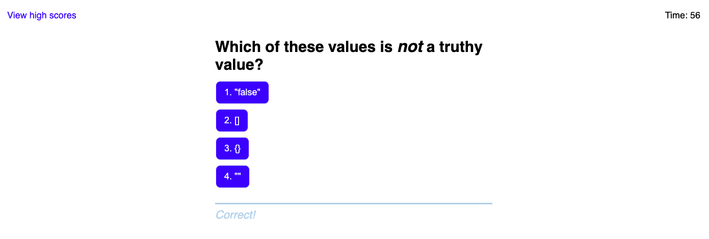

# 4. Web APIs Challenge: Code Quiz

## Description

This application takes the user through a timed, 10 question multiple choice  JavaScript fundamentals quiz. Other than the elements on first page that is loaded upon launch, each HTML element in the quiz is dynamically created using JavaScript DOM methods. The user is able to traverse the quiz thanks to the use of event listeners that trigger the dynamic HTML. Along with the quiz itself, this application features a scoreboard logging all of the scores that have been saved by users on the same device. The scores are saved using localStorage.

## Deployment

You can visit the live application [here](https://aidanamato.github.io/code-quiz/).

## License

[MIT](./LICENSE.txt)